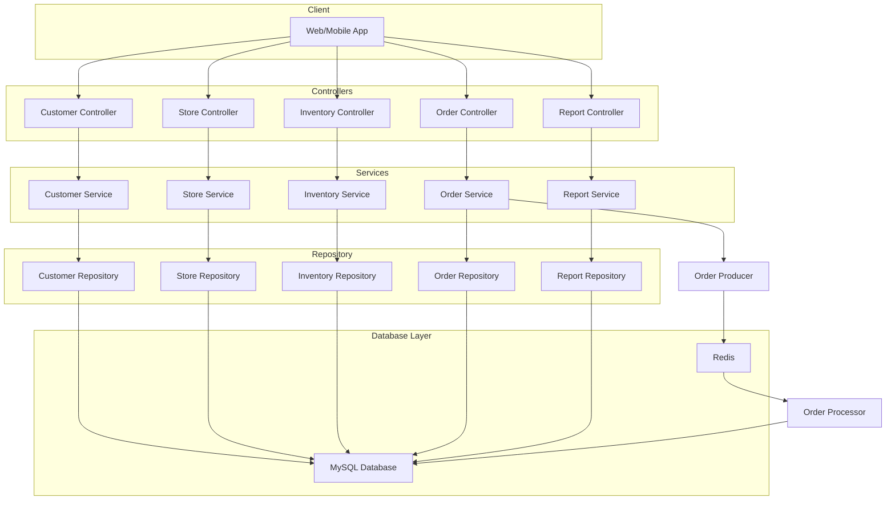
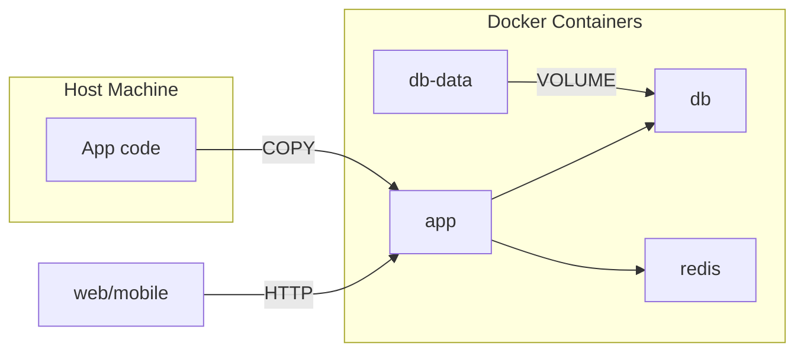
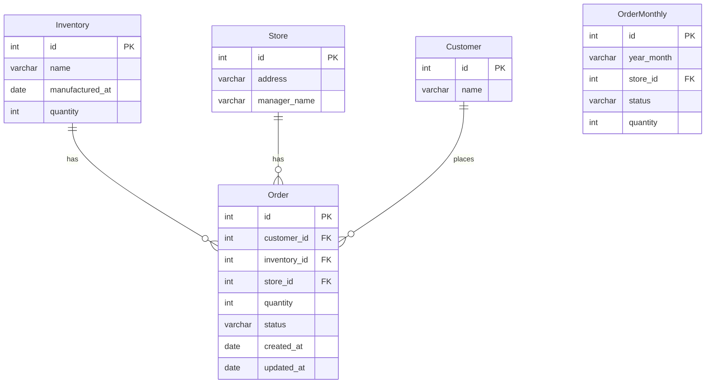
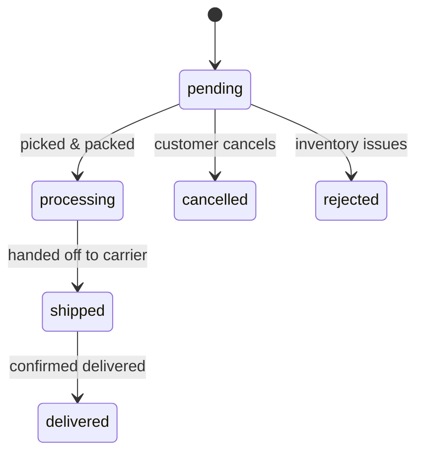

## Description

Handles the backend data integration for consumers and candy products.

## Data flow



## Containerization



## Setup

1. Make sure docker compose is installed

```bash
# copy and fix environment variables
cp .env.sample .env

```

## Running the app

```bash
# development with watch mode
make run-development-server

# production mode (TODO)
npm run start:prod
```

## Test & Lint

```bash
# lint
make lint

# unit tests
make test

# test coverage
make test-cov

# load test
docker compose run --rm k6 run --vus 100 --iterations 3000 --rps 400  /app/test/loadtest_get.spec.ts
docker compose run --rm k6 run --vus 100 --iterations 3000 --rps 400  /app/test/loadtest_post_orders.spec.ts
docker compose run --rm k6 run --vus 100 --iterations 3000 --rps 400  /app/test/loadtest_get_report.spec.ts
```

## Migrations
```bash
# apply migrations
docker compose exec app npm run migration:run

# revert migrations
docker compose exec app npm run migration:revert

# create new migration
docker compose exec app npm run migration:create --name=your_migration_name

# generate migration
docker compose exec app npm run migration:generate --name=your_migration_name
```

## Pre-commit hooks

```sh
# Sets husky pre-commit hooks
npm run prepare
```

## Database schema


### Order Statuses

| Status       | Description                                                         |
|--------------|---------------------------------------------------------------------|
| `pending`    | The order has been placed but hasn't been processed yet.            |
| `processing` | The order is being prepared for shipment.                           |
| `shipped`    | The order has been shipped.                                         |
| `delivered`  | The order has been delivered.                                       |
| `cancelled`  | The order has been canceled.                                        |
| `rejected`   | The order has been rejected (e.g., due to insufficient inventory).  |

**Transitions**



## API Endpoints

| HTTP Method | Endpoint               | Description                       |
|-------------|------------------------|-----------------------------------|
| GET         | [/customers](#get-customers) | List all customers          |
| POST        | [/customers](#post-customers) | Create a new customer |
| GET         | [/customers/:id](#get-customersid) | View a specific customer by ID    |
| PUT         | [/customers/:id](#put-customersid) | Modify customer by ID |
| GET         | [/stores](#get-stores)       | List all stores             |
| POST        | [/stores](#post-stores)      | Create a new store          |
| GET         | [/stores/:id](#get-storesid) | View a specific store by ID |
| PUT         | [/stores/:id](#put-storesid) | Modify store by ID          |
| GET         | [/inventories](#get-inventories)       | List all inventories            |
| POST        | [/inventories](#post-inventories)      | Create a new inventory          |
| GET         | [/inventories/:id](#get-inventoriesid) | View a specific inventory by ID |
| PUT         | [/inventories/:id](#put-inventoriesid) | Modify inventory by ID          |
| GET         | [/orders](#get-orders)       | List all orders             |
| POST        | [/orders](#post-orders)      | Create a new order          |
| GET         | [/orders/:id](#get-ordersid) | View a specific order by ID |
| PUT         | [/orders/:id](#put-ordersid) | Modify order by ID          |
| GET         | [/report](#get-report)           | Monthly report for orders grouped by store and status |


### GET /customers

Retrieves a list of all customers. Ordered by ID ascending.

**Query Parameters:**

* offset (optional): Offset number (default: 0)
* limit (optional): Number of customers per page (default: 10. Max 100)

**Response (200 OK):**

```json
{
  "result": [
    {
      "id": 16,
      "name": "Best Buy112"
    }
  ],
  "pagination": {
    "offset": 15,
    "limit": 5,
    "total": 16
  }
}
```

### POST /customers

Creates a new customer

**Payload**
```json
{ "name": "PharmaSave" }
```

**Response (201 OK):**

```json
{ "id": 1, "name": "PharmaSave" },
```

### GET /customers/:id

View customer by id

**Response (200 OK):**

```json
{ "id": 1, "name": "Foot Locker"}
```

**Response (404 Not found):**

```json
{"message":"Not found","error":"Not Found","statusCode":404}
```

### PUT /customers/:id

Updates a customer by ID.

**Payload**

```js
{
  "name": "John Smith" // Updated name
}
```

**Response (200 OK):**

```js
{
  "id": 1,
  "name": "John Smith" // Updated customer
}
```

**Response (404 Not found):**

```json
{"message":"Not found","error":"Not Found","statusCode":404}
```

### GET /stores

Retrieves a list of all stores. Ordered by ID ascending.

**Query Parameters:**

-   offset (optional): Offset number (default: 0)
-   limit (optional): Number of stores per page (default: 10. Max 100)

**Response (200 OK):**

```json
{
  "result": [
    {
      "id": 1,
      "address": "123 Main St",
      "manager_name": "John Doe"
    }
  ],
  "pagination": {
    "offset": 0,
    "limit": 10,
    "total": 1
  }
}
```

### POST /stores

Creates a new store

**Payload**

```json
{ "address": "456 Elm St", "manager_name": "Jane Doe" }
```

**Response (201 OK):**

```json
{ "id": 2, "address": "456 Elm St", "manager_name": "Jane Doe" },
```

### GET /stores/:id

View store by id

**Response (200 OK):**
```json
{ "id": 1, "address": "123 Main St", "manager_name": "John Doe"}

```

**Response (404 Not found):**

```json
{"message":"Not found","error":"Not Found","statusCode":404}
```

### PUT /stores/:id

Updates a store by ID.

**Payload**

```js
{
  "manager_name": "Updated Manager" // Updated manager name
}
```

**Response (200 OK):**

```js
{
  "id": 1,
  "address": "789 Oak St",
  "manager_name": "Updated Manager" // Updated manager name
}
```

**Response (404 Not found):**

```json
{"message":"Not found","error":"Not Found","statusCode":404}
```

### GET /inventories

Retrieves a list of all inventories. Ordered by ID ascending.

**Query Parameters:**

* offset (optional): Offset number (default: 0)
* limit (optional): Number of inventories per page (default: 10. Max 100)

**Response (200 OK):**

```json
{
  "result": [
    {
      "id": 1,
      "name": "SmartiesBoxTruck",
      "manufactured_at": "2023-10-26T00:00:00.000Z",
      "quantity": 100
    },
    {
      "id": 2,
      "name": "CandyCornRv",
      "manufactured_at": "2023-10-27T00:00:00.000Z",
      "quantity": 50
    }
  ],
  "pagination": {
    "offset": 0,
    "limit": 10,
    "total": 2
  }
}
```

### POST /inventories

Creates a new inventory

**Payload**

```json
{ "name": "CandyCornRv", "manufactured_at": "2023-10-27T00:00:00.000Z", "quantity": 50 }
```

**Response (201 OK):**

```json
{ "id": 3, "name": "CandyCornRv", "manufactured_at": "2023-10-27T00:00:00.000Z", "quantity": 50 },
```

### GET /inventories/:id

View inventory by id

**Response (200 OK):**

```json
{ "id": 1, "name": "SmartiesBoxTruck", "manufactured_at": "2023-10-26T00:00:00.000Z", "quantity": 100}
```

**Response (404 Not found):**

```json
{"message":"Not found","error":"Not Found","statusCode":404}
```

### PUT /inventories/:id

Updates an inventory by ID.

**Payload**

```js
{
  "quantity": 150
}
```

**Response (200 OK):**

```js
{
  "id": 1,
  "name": "SmartiesBoxTruck",
  "manufactured_at": "2023-10-26T00:00:00.000Z",
  "quantity": 150 // Updated quantity
}
```

**Response (404 Not found):**

```json
{"message":"Not found","error":"Not Found","statusCode":404}
```

### GET /orders

Retrieves a list of all orders. Ordered by ID ascending.

**Query Parameters:**

* offset (optional): Offset number (default: 0)
* limit (optional): Number of orders per page (default: 10. Max 100)

**Response (200 OK):**

```json
{
  "result": [
    {
      "id": 1,
      "customer_id": 1,
      "inventory_id": 1,
      "store_id": 1,
      "quantity": 10,
      "status": "pending",
      "created_at": "2023-10-26T00:00:00.000Z",
      "updated_at": "2023-10-26T00:00:00.000Z"
    }
  ],
  "pagination": {
    "offset": 0,
    "limit": 10,
    "total": 1
  }
}
```

### POST /orders

Creates a new order

**Payload**
```json
{
  "customer_id": 2,
  "inventory_id": 3,
  "store_id": 1,
  "quantity": 5,
  "status": "pending"
}
```

**Response (201 OK):**

```json
{
  "id": 3,
  "customer_id": 2,
  "inventory_id": 3,
  "store_id": 1,
  "quantity": 5,
  "status": "pending",
  "created_at": "2023-10-27T00:00:00.000Z",
  "updated_at": "2023-10-27T00:00:00.000Z"
}
```

### GET /orders/:id

View order by id

**Response (200 OK):**

```json
{
  "id": 1,
  "customer_id": 1,
  "inventory_id": 1,
  "store_id": 1,
  "quantity": 10,
  "status": "shipped",
  "created_at": "2023-10-26T00:00:00.000Z",
  "updated_at": "2023-10-26T00:00:00.000Z"
}
```

**Response (404 Not found):**

```json
{"message":"Not found","error":"Not Found","statusCode":404}
```

### PUT /orders/:id

Updates the store by ID

**Payload**
```js
{
  "status": "shipped"
}
```

**Response (200 OK):**

```js
{
  "id": 1,
  "customer_id": 1,
  "inventory_id": 1,
  "store_id": 1,
  "quantity": 10,
  "status": "shipped",  // updated status
  "created_at": "2023-10-26T00:00:00.000Z",
  "updated_at": "2023-10-26T00:00:00.000Z"
}
```

**Response (404 Not found):**

```json
{"message":"Not found","error":"Not Found","statusCode":404}
```

### GET /report

Monthly report for orders grouped by store and status

**Query parameters**

* year_month_min: YYYY-MM (default: current month)
* year_month_max: YYYY-MM (default: current month)
* store_ids (optional): Array store IDs (default: all stores)
* status_list (optional): Array of status (default: all statuses)

**Response (200 OK):**

```json
[
  {
    "store_id": 27,
    "status": "pending",
    "quantity": 10,
    "year_month": "2023-10"
  },
  {
    "store_id": 27,
    "status": "shipped",
    "quantity": 5,
    "year_month": "2023-10"
  },
  {
    "store_id": 13,
    "status": "pending",
    "quantity": 2,
    "year_month": "2023-10"
  },
]
```

## License

[MIT licensed](LICENSE).
