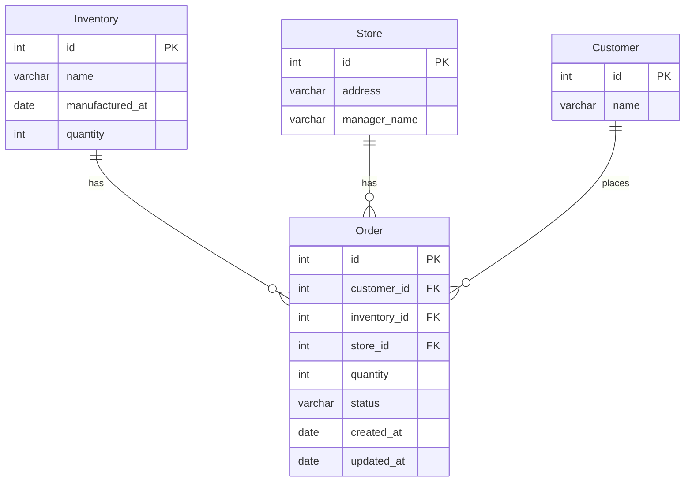

## Description

[Nest](https://github.com/nestjs/nest) framework TypeScript starter repository.

## Setup

1. Make sure docker compose is installed

```bash
# copy and fix environment variables
cp .env.sample .env

```

## Running the app

```bash
# development with watch mode
make run-development-server

# production mode (TODO)
npm run start:prod
```

## Test & Lint

```bash
# lint
$ make lint

# unit tests
$ make test

# test coverage
$ make test-cov
```

## Migrations
```bash
# apply migrations
docker compose exec app npm run migration:run

# revert migrations
docker compose exec app npm run migration:revert

# create new migration
docker compose exec app npm run migration:create --name=your_migration_name

# generate migration
docker compose exec app npm run migration:generate --name=your_migration_name
```

## Pre-commit hooks

```sh
# Sets husky pre-commit hooks
npm run prepare
```

## Database schema


## API Endpoints

| HTTP Method | Endpoint               | Description                       |
|-------------|------------------------|-----------------------------------|
| POST        | [/customers](#post-customers) | Create a new customer |
| GET         | [/customers/:id](#get-customersid) | View a specific customer by ID    |
| PUT         | [/customers/:id](#put-customersid) | Modify customer by ID |

### POST /customers

Creates a new customer

**Payload**
```json
{ "name": "PharmaSave" }
```

**Response (201 OK):**

```json
{ "id": 1, "name": "PharmaSave" },
```

### GET /customers/:id

View customer by id

**Response (200 OK):**

```json
{ "id": 1, "name": "Foot Locker"}
```

**Response (404 Not found):**

```json
{"message":"Not found","error":"Not Found","statusCode":404}
```

### PUT /customers/:id

Updates a customer by ID.

**Payload**

```js
{
  "name": "John Smith" // Updated name
}
```

**Response (200 OK):**

```js
{
  "id": 1,
  "name": "John Smith" // Updated customer
}
```

**Response (404 Not found):**

```json
{"message":"Not found","error":"Not Found","statusCode":404}
```


## License

[MIT licensed](LICENSE).
